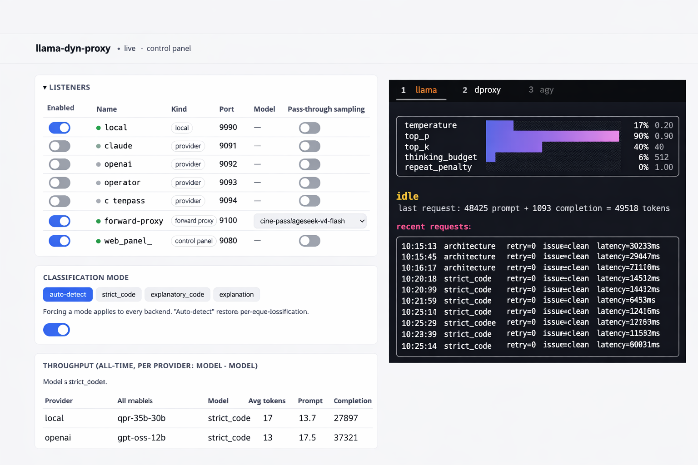

# Adaptive LLM Sampling Proxy



A lightweight reverse proxy that sits between an OpenAI-compatible client
(Cline, opencode, any agent tool) and a local `llama-server` instance or a
remote provider. It classifies each chat request by task type, injects
sampling/reasoning parameters accordingly, detects bad outputs and retries
with adjusted parameters, guards against runaway reasoning loops, converts
images to text descriptions for text-only models, and shows everything live
on a terminal dashboard and/or a browser control panel.

**No Mirostat.** Mirostat was evaluated and rejected — it requires a
full-vocabulary sort/entropy calculation on every token, which is CPU-bound
and roughly halved generation speed in testing. All dynamic behavior comes
from bounded temperature + top-p/top-k + reasoning-budget control instead,
at full decode speed.

## Build & run

```sh
go build -o llama-dyn-proxy .     # single static binary

# start llama-server first, e.g.:
llama-server --port 9091 ...

# then one of:
./llama-dyn-proxy                 # local backend + terminal dashboard
./llama-dyn-proxy --web           # ALL backends + browser panel on :9080
./llama-dyn-proxy --web --web-port 8080
./llama-dyn-proxy openrouter      # one dedicated remote-provider backend
./llama-dyn-proxy --alert         # enable alert-continuation (see below)
./llama-dyn-proxy --report        # print the persisted throughput report and exit
```

On first run it creates `config.ini` next to the binary with documented
defaults — every feature below is configured there, no code changes needed.
Point your client's OpenAI-compatible `base_url` at
`http://127.0.0.1:<listen_port>/v1` (default `9099` for local).

**Diagnostics go to `proxy_<backend>.log`** (`proxy_web.log` in `--web`
mode), not the terminal — the dashboard owns the display once it starts.
The log path is printed once at startup. `Ctrl+C` shuts down cleanly.

```sh
go test ./...                     # full test suite
```

## Features

- **Task classification** — each request is bucketed
  (`strict_code` / `exploratory_code` / `explanation` / `architecture`)
  by keyword match on the latest user message.
- **Per-bucket sampling presets** — temperature / top_p / top_k /
  thinking_budget_tokens injected per bucket; explicit client values
  always win.
- **Issue detection + adaptive retry** — repetition, truncation, bad
  JSON syntax, and empty responses each trigger a targeted parameter
  adjustment and an automatic retry, invisible to the client.
- **Reasoning guard** — live, mid-stream abort of a model stuck in an
  infinite reasoning loop (post-hoc detection can never catch a stream
  that never ends), retried like any other issue.
- **Vision describe** — images in any request are described once by a
  configurable VLM (local or cloud) and replaced with text, so text-only
  models handle image-bearing conversations; cached per image.
- **Alert continuation** (`--alert`) — nudges a model that stopped early
  on an unfinished task to continue, accumulating the full answer.
- **Live activity indicator** — real-time bucket/model/token/tok-s/idle
  countdown display for the in-flight request, even against remote
  providers that otherwise show nothing until done.
- **Keepalive** — long generations emit periodic well-formed heartbeat
  chunks so clients with hard idle timeouts (Cline: ~5 min) never
  disconnect mid-request.
- **Idle (inactivity) timeout** — cuts off genuine upstream silence
  without ever killing a slow-but-progressing generation.
- **Throughput stats** — per provider/model/bucket tok/s aggregates,
  persisted across restarts; `--report` prints them, the dashboards show
  them live. Rates use generation-only time (prefill excluded).
- **Retry trajectory log** — every retried request's full adjustment
  history as JSONL, for data-driven tuning instead of guessing.
- **Web control panel** (`--web`) — all backends at once with live
  start/stop, per-listener sampling bypass, model picker, global toggles.
- **Remote providers** — dedicated reverse-proxy port per configured
  vendor (claude/gemini/openai/openrouter/clinepass), with auth and model
  override.
- **Forward-proxy (MITM) mode** — intercept any vendor's HTTPS traffic
  via `HTTPS_PROXY` with zero per-vendor config; hard host allowlist.
- **Tool schema sanitizer** — strips schema constraints that crash
  llama.cpp's grammar converter on large agent tool sets.
- **CORS everywhere** — browser-based clients work against every
  listener, with requested headers reflected.

## Features in detail

### Task classification

The latest user-role message is matched (case-insensitive substring)
against the keyword lists in `[classification]`. Multiple matches are
broken by `priority_order`; no match falls back to `default_bucket`.
Keep keywords to single words — matching is plain substring containment,
so `"write function"` misses "write the function" while `"write"` matches
everything. The dashboard can also **force** a bucket for every request
(useful when auto-detection picks wrong), from the TUI keybinding or the
web panel.

### Sampling presets

The matching `[preset.<bucket>]` values (`temperature`, `top_p`, `top_k`,
`thinking_budget_tokens`) are merged into the outgoing request — but only
for fields the client did not already set explicitly. `repeat_penalty`,
DRY, and `min_p` are never injected on a first pass: `min_p` is left to
llama-server's own adaptive default, and repeat_penalty/DRY are reserved
for the retry path, so a clean request never carries them.
`inject_thinking_budget_tokens` (in `[server]`) gates the budget field
globally, for backends running with reasoning disabled server-side.

### Issue detection + adaptive retry

The full response is accumulated internally (see "Always-stream" below)
and inspected before the client sees anything. On an issue, the proxy
adjusts the relevant parameter and resends the **identical** messages
(only sampling params change, so llama-server's KV cache is reused):

| issue | detection | adjustment |
|---|---|---|
| `repetition` | sliding n-gram window, clustered within `repetition_window_words`, gated on `finish_reason == "length"` by default | DRY (`dry_multiplier` escalating additively) or `repeat_penalty += increment` |
| `truncated` | `finish_reason == "length"` + unbalanced braces/fences | `max_tokens *= multiplier` from the **real** generated count, capped at ceiling |
| `bad_syntax` | invalid JSON inside fenced ` ```json ` blocks | `temperature -= decrement`, floored at `temperature_floor` (never exactly 0) |
| `empty` | blank content despite clean finish_reason, no tool calls | `temperature += increment`, capped at `temperature_ceiling` — the *opposite* direction: a blank response is usually an unlucky early-EOS draw, not something determinism fixes |
| `reasoning_loop` | live, mid-stream (see below) | same remedy as repetition — it's the same failure caught earlier |

Successive retries within one request scale their step by
`retry_step_exponent^attempt` (default `1.0` = flat steps).

**Repetition false positives** are the main tuning hazard: agentic output
is full of legitimately repeated structure (tool tags, file paths). Two
config gates exist because both failure modes were hit in practice:
`repetition_window_words` (real loops cluster tightly; legitimate code
repeats scatter) and `repetition_requires_length_finish` (a real
degenerate loop never stops on its own — it runs to the token cap — while
every confirmed false positive completed normally with `"stop"`).

### Retry trajectory log

Every request that retried at least once appends one JSON line to
`retry_log_<backend>.jsonl` — bucket, exponent, each adjustment
(old/new value + the exact n-gram or detail that triggered it),
`resolved`, attempts, latency. Read the `detail` field first when retries
seem too frequent: if the logged n-grams are tool tags or file paths, tune
`[detection]` rather than the sampling params. Compare `resolved` rate and
`total_attempts` across `retry_step_exponent` values to tune it from data
instead of guessing.

### Reasoning guard (`[reasoning_guard]`)

Some models (confirmed live via packet capture: a Gemma-family model
emitted 7,800+ reasoning chunks over 2+ minutes without one content token)
get stuck in a degenerate *reasoning* loop that never naturally ends. All
the post-hoc detection above only ever inspects a **completed** response —
useless against a stream that never completes. This guard counts
`reasoning_content` chunks as they stream and aborts once they exceed the
request's `thinking_budget_tokens × budget_multiplier` (or
`fallback_max_reasoning_tokens` when no budget was requested), feeding
`reasoning_loop` into the normal retry machinery. The abort logs to
`proxy_<backend>.log` (`reasoning-guard (...): aborting after N chunks`).

### Vision describe (`[vision_describe]`)

Turns an image-bearing chat request into an all-text one before it reaches
the target model:

```
client request arrives
  └─ walk messages[] for image blocks
       └─ hash image → cached description, or one VLM call (cached after)
       └─ replace block with {"type":"text","text":"[IMAGE DESCRIPTION: ...]"}
  └─ forward cleaned request to the target model, unchanged routing
```

- **Global**: applies to every listener (local and remote), toggleable
  live from the web panel.
- **VLM endpoint is configurable**: `base_url` + optional `api_key` for a
  cloud VLM (default: Cline's gateway with `stepfun/step-3.7-flash`;
  the api_key falls back through `CLINEPASS_API_KEY` / the
  clinepass-connector's stored login), or clear `base_url` to use the
  local llama-server (`model` must then be a locally served vision model).
- Describe calls always use `stream:true` — Cline's gateway rejects
  non-streaming requests with "empty response content".
- The description cache is in-memory, keyed by sha256 of the image data
  URI — a client resends the same image every turn, and only the first
  sighting pays the VLM round-trip.
- A describe failure never fails the real request: the image becomes
  `[IMAGE: description unavailable]` (leaving a raw image part in place
  would choke a text-only chat template).

### Alert continuation (`--alert`)

Some models end their turn early on a genuinely unfinished multi-step
task (`finish_reason "stop"`, not truncated). With `--alert` and
`alert_models` configured (`*` = any model), the proxy sends a follow-up
probe (`alert_probe_message`) when a turn ends naturally: a model that's
genuinely done answers briefly (detected and dropped, not appended); one
that stopped short resumes the work, which is appended to the accumulated
response — up to `alert_max_rounds`. In `--web` mode this is a per-listener
toggle on the local backend.

### Always-stream upstream + live activity indicator

For `/v1/chat/completions` the request is always sent upstream with
`stream:true` regardless of what the client asked for. The proxy observes
generation as it happens (enabling everything below), accumulates the full
text (enabling detection/retry above), then either synthesizes a complete
JSON response or re-chunks back into SSE for streaming clients —
preserving `reasoning_content` as its own delta chunks, and slicing by
rune so formatting/UTF-8 survive byte-for-byte.

The dashboard's in-flight line shows what's running right now:

```
generating (strict_code, attempt 1) [qwen3-vl]... ~340 tokens (est) · 4.2s elapsed · ~62.4 tok/s (est) · idle timeout in 1793s
```

- The elapsed timer ticks from **before the first upstream byte** —
  covering both provider-side queueing and prompt prefill (labeled
  `processing prompt`, which is what's actually happening) — so a queued
  or prefilling request never looks identical to `idle`.
- `[model]` shows which model is actually doing the work — visible when
  vision-describe or a live model override redirects a request.
- tok/s divides by **generation-only time** (a clock started at the first
  real token), never total elapsed — dividing by total would fold prefill
  into the rate and understate it badly.
- Token counts during streaming are chunk-count estimates (1 delta ≈ 1
  token, true for llama.cpp; `tokens_sec_multiplier` per provider corrects
  vendors that batch). Once a request finishes, exact counts from the
  `usage` object are shown: `last request: 727 prompt + 1437 completion`.
  Missing `usage`/`prompt_tokens` from upstream is logged, not silently
  zero.

### Keepalive + idle timeout

Two complementary timers govern long requests:

- **Keepalive** (client-facing): the classify/retry cycle buffers the
  entire response before the client sees anything, and a client with a
  hard idle timeout (Cline: ~5 min) would disconnect. Past a 60s grace
  period the proxy commits to SSE and emits a well-formed empty-delta
  heartbeat chunk every 15s — real JSON the OpenAI SDK parses cleanly, not
  a bare comment line (which broke Cline's decoder in practice).
- **Idle timeout** (upstream-facing, `request_timeout_seconds`): a genuine
  *inactivity* timeout, not a wall-clock ceiling — it resets on every sign
  of progress, so a slow-but-streaming generation can run indefinitely and
  only true silence is cut off. The dashboard shows a live countdown.

### Throughput stats + `--report`

Every clean (no-retry) chat completion accumulates into per
(provider, model, bucket) aggregates — samples, token sums, min/avg/max
tok/s — persisted to `throughput_stats_<backend>.json` and surviving
restarts and retry-log rotation. `./llama-dyn-proxy --report` prints the
table and exits; both dashboards show it live (the web panel's version is
sortable and model-filterable). Rates are computed from generation-only
time — using total latency (as an earlier version did) silently diluted
reported rates by prefill time, reading ~half the live indicator's value.
A raw per-request `throughput` JSONL line also lands in the retry log.

### Web control panel (`--web`)

Runs **every** configured backend at once (local + each `[provider.*]` +
forward-proxy), each on its own port, supervised:

- Start/stop any listener live — the TCP port binds/unbinds on toggle.
- Live mirror of the request log, in-flight indicator, sampling bars, and
  throughput table over server-sent events.
- Per-listener **pass-through sampling** toggle (client's own params, no
  retries) without stopping the listener.
- Per-backend **model picker** — clinepass gets the full live catalog
  grouped by billing tier; takes effect next request.
- Global **classification mode** force and **vision describe** toggle.
- Alert-continuation toggle on the local backend.

The terminal dashboard still runs alongside when there's a TTY; headless
(SSH/service) it's browser-only. Diagnostics: `proxy_web.log`.

**clinepass credential**: resolved from `[provider.clinepass] api_key` →
`CLINEPASS_API_KEY` → the standalone clinepass-connector's saved login
(`~/.config/clinepass-connector/config.json`), prompting once on a
terminal if none is found. clinepass chat requires an API key — the
account/browser login is rejected by its chat endpoint.

### Remote providers (`[provider.*]`)

Each configured vendor (claude, gemini, openai, openrouter, clinepass)
gets its own reverse-proxy port; `./llama-dyn-proxy <name>` runs one
dedicated, `--web` runs them all. A configured `model` always overrides
the client's (a local model name is almost certainly invalid remotely);
blank passes it through. `{PROVIDER}_API_KEY` env vars win over
`config.ini` keys, so real keys never have to sit in plaintext. The
outbound request targets exactly `<base_url>/chat/completions` — never the
client's incoming path, since most base_urls already end in `/v1`.
clinepass additionally sets `allow_passthrough` so Cline's auxiliary
account endpoints (token refresh, etc.) pass through instead of 501ing.

### Forward-proxy (MITM) mode (`[forward_proxy]`)

The inverse of `[provider.*]`: the agent keeps its own real
`base_url`/key/model, and you point its `HTTP_PROXY`/`HTTPS_PROXY` at this
proxy instead. Intercepted traffic runs the same
classify/inject/detect/retry pipeline, then forwards to the real
destination — zero per-vendor config, works for any OpenAI-compatible
vendor.

```sh
alias pcline='HTTP_PROXY="http://127.0.0.1:9100" HTTPS_PROXY="http://127.0.0.1:9100" NODE_EXTRA_CA_CERTS="/path/to/root.crt" npx cline'
```

- **A CA certificate is required**: HTTPS is opaque to a plain forward
  proxy, so TLS must be terminated locally. `ca_cert_path`/`ca_key_path`
  must point at an existing intermediate CA (see
  [`cert/README.md`](cert/README.md) for the generation script) — this
  proxy never creates its own. Each tool must trust the CA root its own
  way (`NODE_EXTRA_CA_CERTS` for Node tools, `SSL_CERT_FILE`/OS store for
  others); certificate-pinning tools cannot work through this at all.
- **`allowed_hosts` is a hard allowlist**: a CONNECT to any unlisted host
  gets a plain byte-for-byte tunnel — zero decryption. Only listed
  hostnames are ever inspected, which bounds the exposure of routing other
  traffic through it.
- **`passthrough_hosts`** (subset of allowed): non-chat paths forward
  verbatim instead of 501 — needed for gateways like `api.cline.bot` that
  serve account endpoints on the same host.
- Also accepts CORS-style requests with the target URL embedded in the
  path (`http://localhost:9100/https://openrouter.ai/api/v1/...`) for
  browser-based tools.

### Tool schema sanitizer (`[tool_schema_sanitizer]`)

llama.cpp's JSON-schema→GBNF converter turns string
`maxLength`/`minLength`/`pattern` constraints into repetition rules, and a
large agent tool set (Cline + several MCP servers) can push the grammar
past llama.cpp's internal cap — the request then dies with "failed to
parse grammar" before generation starts. When enabled, the proxy strips
the offending constraints from tool schemas. `strip_max_length` is the
proven blowup vector; the others are opt-in extras.

### CORS

Every listener (reverse-proxy and forward-proxy alike) sends permissive
CORS headers, reflecting `Access-Control-Request-Headers` on preflight so
browser tools sending custom headers (e.g. `X-Title`) work, and answering
`OPTIONS` with a clean 204.

## Project layout

```
main.go           // wiring: config, backend resolution, HTTP server + dashboard, --report, graceful shutdown
config.go         // config.ini load/parse, defaults template
classify.go       // task classification
proxy.go          // request pipeline: classify/inject/detect/retry, keepalive, providers, throughput, logs
stream.go         // always-stream upstream, SSE parse/accumulate, reasoning guard, progress events, re-chunking
detect.go         // repetition/truncation/syntax/empty issue detection
alert.go          // alert-continuation heuristics
vision_describe.go // image→text describe-and-replace pipeline + cache
throughput_stats.go // persisted per-(provider,model,bucket) aggregates, --report formatting
ui.go             // bubbletea terminal dashboard
mitm.go           // forward-proxy mode: CA/leaf certs, CONNECT, TLS termination, CORS-style path
web.go / web_page.go / web_mode.go / supervisor.go / broker.go  // --web control panel
clinepass_*.go    // clinepass credential/catalog integration

config.ini                       // generated with documented defaults on first run
proxy_<backend>.log              // diagnostics (the dashboard owns the terminal)
retry_log_<backend>.jsonl        // per-retried-request adjustment trajectories + raw throughput lines
throughput_stats_<backend>.json  // persisted throughput aggregates
```

## Tests

```sh
go test ./...          # also clean under: go test -race ./...
```

The suite covers every feature above end-to-end against fake upstreams —
classification, preset merging (client-wins), each issue type's detection
and retry adjustment, exponent scaling, the reasoning guard aborting a
never-ending stream, vision describe (replacement, caching by hash,
failure placeholder, provider-listener scope, live toggle), alert
continuation, keepalive heartbeats, idle timeout, throughput persistence
and generation-time-only rates, provider routing/auth/model override, the
forward-proxy CONNECT/allowlist/passthrough paths, CORS on every listener,
SSE re-chunking fidelity (byte-for-byte, rune-safe), and the web panel's
API. Most tests encode a specific regression found in production via the
retry logs or live packet captures — the log-derived tuning workflow this
README describes is the same one used to build it.
